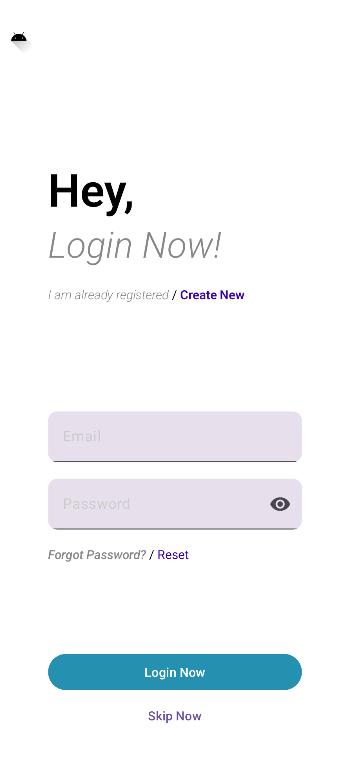
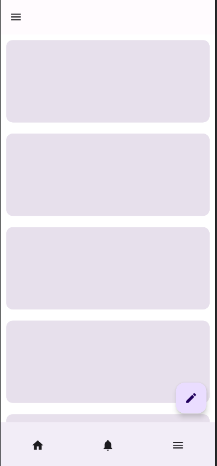
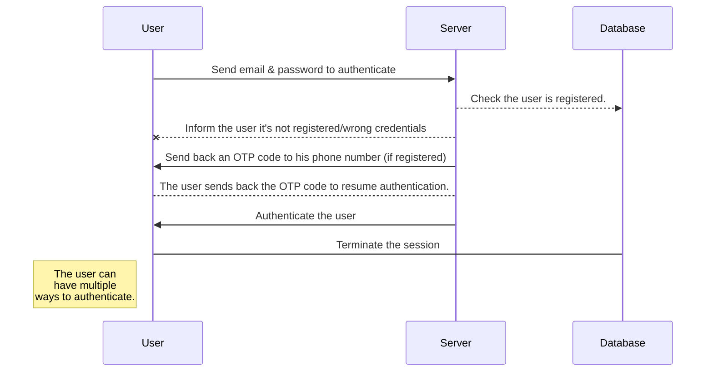
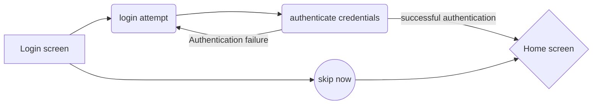

# Kbuddy

# Welcome to Kbuddy
Hi! This is **Kbuddy**!
 An open source collaborative Android project.
 It aims at providing a convenient self-contained way to preserve past memories in a minimalist gallery-like way. Former vacations, hangouts, visits diary with everything that's worth to be remembered.
 Just the moments that worth to be remembered!

# Features
- Login system.
- Home screen
	- Preview former vacations.
	- Navigation to preferences.
	- Add new vacation.
- Preferences screen
	- Application theme.
	- Notifications.
	- Overall configuration

## Showcase

     &nbsp; 
     &nbsp; 

## Install
As of now that app hasn't been published to either the Playstore, but initially would be published on Github [Releases](https://github.com/KDiaryApp/kbuddy/releases) section.
> Before starting to publish, you must link an account in the **Publish** sub-menu.
> The app is still under development, and by no means is considered to be usable.

# Synchronization
There should be multiple viable options that the user should be able to choose from, depending on its current status, and overall preferences.

 There are multiple possible solutions, namely
 - [ ] Save User data & settings locally.
- [ ] Sync former vacations across user devices
	- [ ] Sync the data using a remote cloud storage.
	- [ ] Sync to user-controlled cloud environment.
	- [ ] Migrate the data easily for remote cloud or backup solution.

## Current authentication Flow

## Initial login process

## Social media platforms

|				|Kbuddy						   |Social media	   |
|---------------|------------------------------|-------------------|
|Focus			|`focused on former memories`  |Assortment of everything|
|Aim			|`preserving worthy moments`   |Revenue making machine	|
|Privacy		|`Completely respecting privacy`|Data aggregation for marketing|
